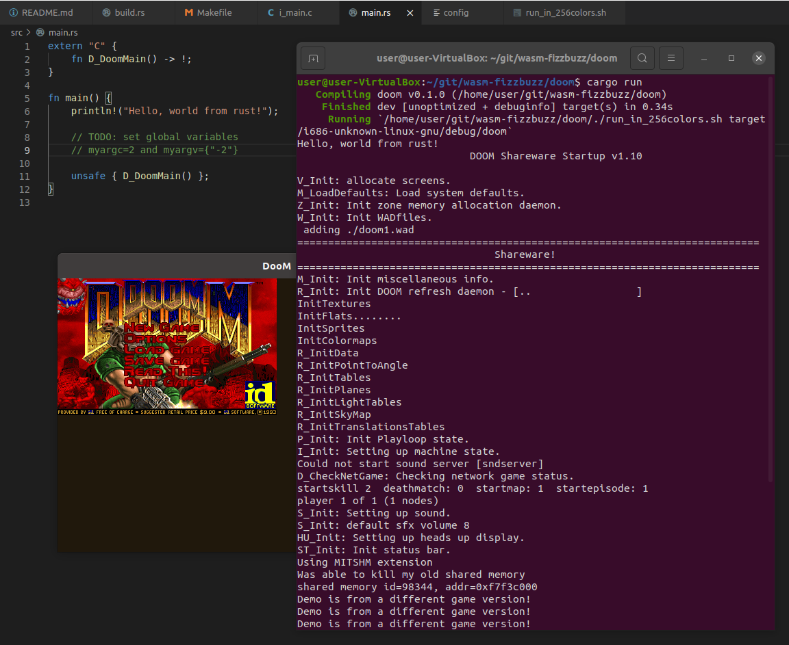

# But can it run Doom?

Can we get the original DOOM game from the 1997 sources to run on WebAssembly?
I guess many have achieved this already.
And with [Emscripten](https://emscripten.org/), there is a generic approach for compiling C applications for the web.
But we want to build everything from scratch in this series, without Emscripten.

---

We start with the original vanilla DOOM sources from <https://github.com/id-Software/DOOM> at [6ed1e40](https://github.com/diekmann/wasm-fizzbuzz/commit/6ed1e4067082bfe61a7b767b91dc981aa1517f94).

Some minor tweaks are necessary to compile the 1997 sources on my 64bit Ubuntu 20.04.

* [fix typos to make it compile more](https://github.com/diekmann/wasm-fizzbuzz/commit/b25788df103cd2173dabe2f6b85ca7c43ed79e27)
* [compiles and starts and segfaults.](https://github.com/diekmann/wasm-fizzbuzz/commit/03ac200ece379f88e40c70f5c506f4376e6417f7)
* [adding doom1.wad shareware.](https://github.com/diekmann/wasm-fizzbuzz/commit/23d4128da47de6c1bbc318a76a1f30bbb3b8a887)
* [fix crash on exit](https://github.com/diekmann/wasm-fizzbuzz/commit/9f52e0d32e55072f3ece809b6b56d5838fd08eb5)
* [super ugly way to run it.](https://github.com/diekmann/wasm-fizzbuzz/commit/c5b980f666a47956eef5df430d0f1195c16716c2)
* [tune Makefile](https://github.com/diekmann/wasm-fizzbuzz/commit/1c14c3b214f93243dd0b33bef7eea0791f78b3c9)
* [thx stackoverflow for fixing colors.](https://github.com/diekmann/wasm-fizzbuzz/commit/e2a66727c0e4f4bc0248d966097bd24f7d655ddf)

In particular, we want to compile with `-m32`, since the Doom source code has many assumptions about the size of an integer and the size of a pointer being 32bits.
Since we want to ultimately port the game to wasm32, where pointers are 32bit as well, there is no need to make the original DOOM sources 64bit-ready.

With those tweaks, DOOM is starting with X11 rendering:


Time to port this to WebAssembly next.

---

Following <https://surma.dev/things/c-to-webassembly/>, we want to compile DOOM as `wasm32`.
But this will be a long journey.
And we cannot play doom once we switch to `wasm32` untill the graphics driver for X11 is removed and replaced by a graphics driver for the web.
Therefore, to test as much as possible and be able to play doom during development, I will develop on X86 for as long as possible and change architecture to `wasm32` reather late.

First, let's replace the compiler from `gcc` to `clang`, turn on optimization, and disable debugging.
This reduces binary size from `1,9M` to `383K`

To get doom ready for the web, we need to do the following

* Replace the X11 graphics driver with something that works in the browser.
* Replace the sound driver with, .... my PC does not have speakers, let's just remove sound.
* Replace all calls DOOM makes into the C stand library (such as `malloc` or `fopen`) with implementations that work in the browser. Either by implementing them in WebAssembly or JavaScript.

Since the year is 2021, there is no reason to write new C code, ...

```
~/git/wasm-fizzbuzz/doom$ cargo init
```

To make the doom C code callable interoperable with rust, we no longer compile it into a binry, but build a static library (`liblinuxxdoom.a`) instead.
Inspired by <https://docs.rust-embedded.org/book/interoperability/c-with-rust.html>, we should be able to call DOOM's `D_DoomMain` from rust then.

We are essentially still working on a 32bit application, remeber?

```
cargo run --target=i686-unknown-linux-gnu
```

Adding a `.cargo/config` to select the default target and a runner...

And we got DOOM starting from rust \m/

