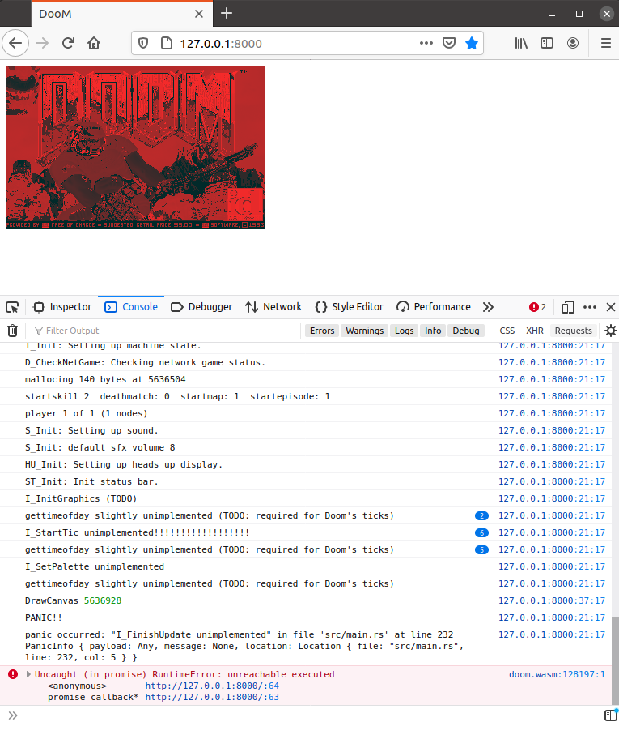

# But can it run Doom?

Porting DOOM seems to be a common challenge.
Can we get [the original DOOM game from the 1997 sources](https://github.com/id-Software/DOOM) to run on WebAssembly?
I guess many have achieved this already.
And with [Emscripten](https://emscripten.org/), there is a generic approach for compiling C applications for the web.
But we want to build everything from scratch in this series, without Emscripten.

---

We start with the original vanilla DOOM sources from <https://github.com/id-Software/DOOM> at [6ed1e40](https://github.com/diekmann/wasm-fizzbuzz/commit/6ed1e4067082bfe61a7b767b91dc981aa1517f94).

Some minor tweaks are necessary to compile the 1997 sources on my 64bit Ubuntu 20.04.

* [fix typos to make it compile more](https://github.com/diekmann/wasm-fizzbuzz/commit/b25788df103cd2173dabe2f6b85ca7c43ed79e27)
* [compiles and starts and segfaults.](https://github.com/diekmann/wasm-fizzbuzz/commit/03ac200ece379f88e40c70f5c506f4376e6417f7)
* [adding doom1.wad shareware.](https://github.com/diekmann/wasm-fizzbuzz/commit/23d4128da47de6c1bbc318a76a1f30bbb3b8a887)
* [fix crash on exit](https://github.com/diekmann/wasm-fizzbuzz/commit/9f52e0d32e55072f3ece809b6b56d5838fd08eb5)
* [super ugly way to run it.](https://github.com/diekmann/wasm-fizzbuzz/commit/c5b980f666a47956eef5df430d0f1195c16716c2)
* [tune Makefile](https://github.com/diekmann/wasm-fizzbuzz/commit/1c14c3b214f93243dd0b33bef7eea0791f78b3c9)
* [thx stackoverflow for fixing colors.](https://github.com/diekmann/wasm-fizzbuzz/commit/e2a66727c0e4f4bc0248d966097bd24f7d655ddf)

In particular, we want to compile with `-m32`, since the Doom source code has many assumptions about the size of an integer and the size of a pointer being 32bits.
Since we want to ultimately port the game to wasm32, where pointers are 32bit as well, there is no need to make the original DOOM sources 64bit-ready.

With those tweaks, DOOM is starting with X11 rendering:


Time to port this to WebAssembly next.

---

Following <https://surma.dev/things/c-to-webassembly/>, we want to compile DOOM as `wasm32`.
But this will be a long journey.
And we cannot play doom once we switch to `wasm32` untill the graphics driver for X11 is removed and replaced by a graphics driver for the web.
Therefore, to test as much as possible and be able to play doom during development, I will develop on X86 for as long as possible and change architecture to `wasm32` rather late.

First, let's replace the compiler from `gcc` to `clang` in [doom's Makefile](https://github.com/diekmann/wasm-fizzbuzz/blob/6597c3956470085f87656ebcc554b905ef748d8e/doom/linuxdoom-1.10/Makefile#L7), turn on optimization, and disable debugging.
This reduces binary the size from `1,9M` to `383K`

To get doom ready for the web, we need to do the following

* Replace the X11 graphics driver with something that works in the browser.
* Replace the sound driver with, .... my PC does not have speakers, let's just remove sound.
* Replace all calls DOOM makes into the C stand library (such as `malloc` or `fopen`) with implementations that work in the browser. Either by implementing them in WebAssembly or JavaScript.

Since the year is 2021, there is no reason to write new C code, ...
So [let's start a new rust project](https://github.com/diekmann/wasm-fizzbuzz/commit/84a850dbe3c5cc38bbe24114460ca45b4ba609e6)!

```
~/git/wasm-fizzbuzz/doom$ cargo init
```

To make the doom C code interoperable with rust, we no longer compile it into a binry, but build a static library (`liblinuxxdoom.a`) instead.
Inspired by <https://docs.rust-embedded.org/book/interoperability/c-with-rust.html>, we should be able to call DOOM's `D_DoomMain` from rust then.
We add a [new entry in Doom's Makefile](https://github.com/diekmann/wasm-fizzbuzz/blob/84a850dbe3c5cc38bbe24114460ca45b4ba609e6/doom/linuxdoom-1.10/Makefile#L105) to compile doom as static archive (not as standalon binary).

Eseentailly, we just tell `ar` to bundle all the objects:

```Makefile
$(O)/liblinuxxdoom.a: $(OBJS)
	$(AR) rcs $@ $^
```

A [`build.rs` file](https://github.com/diekmann/wasm-fizzbuzz/blob/84a850dbe3c5cc38bbe24114460ca45b4ba609e6/doom/build.rs) tells the rust compile to link to `libbinuxxdoom`.

For convenience, we add a [`.cargo/config` file](https://github.com/diekmann/wasm-fizzbuzz/blob/84a850dbe3c5cc38bbe24114460ca45b4ba609e6/doom/.cargo/config) to tell the compiler that we want to build as 32 bit application (`--target=i686-unknown-linux-gnu`) by default and add a runner.

Essentially, we can then simply wrap Doom's main function from `main.rs`.

```rust
extern "C" {
    fn D_DoomMain() -> !;
}

fn main() {
    println!("Hello, world from rust!");

    // TODO: set global variables
    // myargc=2 and myargv={"-2"}

    unsafe { D_DoomMain() };
}

```

And we got DOOM starting from rust \m/


---

Let's remove featurs from doom to make the port to wasm32 simpler.
We remove features while the whole game is still playable on my `i686`, so we can verify that removing the features worked without crashing doom.

1. In [a133155](https://github.com/diekmann/wasm-fizzbuzz/commit/a133155a8027d21b6180f36a330c1931acd1d1c7), I compile the Doom object files with `-nostdlib` to make the resulting archive more standalone. Doom still runs since the stdlib is linked in when the main binary is built. It's just removed from our archive.
1. In [0d6534e](https://github.com/diekmann/wasm-fizzbuzz/commit/0d6534e67a1f94e64229c2c1270376129baab520), we remove sound supprt.
1. In [8ac4030](https://github.com/diekmann/wasm-fizzbuzz/commit/8ac4030e07716e3c4a644fa1df96956b23b0e06e), we remove X11 shared memory support, making Doom rending fallback to the simpler X11 default rendering. Since we need to rewrite the video driver for the web anyway, any simplification here is welcome!

Doom is still playable on `i686`, so removing those features works.

---

Finally, with [a4b57bb](https://github.com/diekmann/wasm-fizzbuzz/commit/a4b57bb410daf9e6c93535ecadf9bdc079ea8c44), we switch the compile target to `wasm32`.

Now, we can no longer play doom, until we got everything running on the web, including a new graphics driver to support rendering to a website.
We can not really test what we will be doing for the next steps, becaue C code no longer compiles to a binary, because there is no `libX11` for wasm32 and we are no longer linking to the standard library.
When trying to `make` the `linuxdoom-1.10` binary, clang's `wasm-ld` dumps 553 lines about in which file what undefined symbol is used.
This is because of the missing libraries for wasm32, in particular `libc`.
`wasm-ld`'s dump will be very helpful to remove some features from doom to get the amount of missing symbols down!

But the `liblinuxxdoom.a` still compiles! We just need to provide the missing functions during link time.

The rust code compiles into a wasm32 file.
But this file cannot yet be executed, since it requires a lot of imports to be provided.

I modified `cargo run` to dump the imports we need.
This currently gives:

```data
  (import "env" "XKeycodeToKeysym" (func $XKeycodeToKeysym (type 1)))
  (import "env" "XNextEvent" (func $XNextEvent (type 5)))
  (import "env" "XCreatePixmap" (func $XCreatePixmap (type 6)))
  (import "env" "XCreateGC" (func $XCreateGC (type 7)))
  (import "env" "XFillRectangle" (func $XFillRectangle (type 8)))
  (import "env" "XCreatePixmapCursor" (func $XCreatePixmapCursor (type 8)))
  (import "env" "XFreePixmap" (func $XFreePixmap (type 5)))
  (import "env" "XFreeGC" (func $XFreeGC (type 5)))
  (import "env" "XPending" (func $XPending (type 3)))
  (import "env" "XWarpPointer" (func $XWarpPointer (type 9)))
  (import "env" "malloc" (func $malloc (type 3)))
  (import "env" "gettimeofday" (func $gettimeofday (type 5)))
  (import "env" "exit" (func $exit (type 2)))
  (import "env" "usleep" (func $usleep (type 3)))
  (import "env" "fwrite" (func $fwrite (type 7)))
  (import "env" "vfprintf" (func $vfprintf (type 1)))
  (import "env" "fputc" (func $fputc (type 5)))
  (import "env" "fflush" (func $fflush (type 3)))
  (import "env" "XPutImage" (func $XPutImage (type 10)))
  (import "env" "XSync" (func $XSync (type 5)))
  (import "env" "puts" (func $puts (type 3)))
  (import "env" "XStoreColors" (func $XStoreColors (type 7)))
  (import "env" "signal" (func $signal (type 5)))
  (import "env" "__isoc99_sscanf" (func $__isoc99_sscanf (type 1)))
  (import "env" "XOpenDisplay" (func $XOpenDisplay (type 3)))
  (import "env" "getenv" (func $getenv (type 3)))
  (import "env" "XMatchVisualInfo" (func $XMatchVisualInfo (type 6)))
  (import "env" "XCreateColormap" (func $XCreateColormap (type 7)))
  (import "env" "XCreateWindow" (func $XCreateWindow (type 11)))
  (import "env" "XInstallColormap" (func $XInstallColormap (type 5)))
  (import "env" "XDefineCursor" (func $XDefineCursor (type 1)))
  (import "env" "XMapWindow" (func $XMapWindow (type 5)))
  (import "env" "XGrabPointer" (func $XGrabPointer (type 9)))
  (import "env" "XCreateImage" (func $XCreateImage (type 10)))
  (import "env" "strlen" (func $strlen (type 3)))
  (import "env" "__ctype_toupper_loc" (func $__ctype_toupper_loc (type 12)))
  (import "env" "sprintf" (func $sprintf (type 1)))
  (import "env" "printf" (func $printf (type 5)))
  (import "env" "fopen" (func $fopen (type 5)))
  (import "env" "strcpy" (func $strcpy (type 5)))
  (import "env" "access" (func $access (type 5)))
  (import "env" "fseek" (func $fseek (type 1)))
  (import "env" "ftell" (func $ftell (type 3)))
  (import "env" "fread" (func $fread (type 7)))
  (import "env" "fclose" (func $fclose (type 3)))
  (import "env" "setbuf" (func $setbuf (type 4)))
  (import "env" "mkdir" (func $mkdir (type 5)))
  (import "env" "strtol" (func $strtol (type 1)))
  (import "env" "putchar" (func $putchar (type 3)))
  (import "env" "getc" (func $getc (type 3)))
  (import "env" "fprintf" (func $fprintf (type 1)))
  (import "env" "socket" (func $socket (type 1)))
  (import "env" "__errno_location" (func $__errno_location (type 12)))
  (import "env" "strerror" (func $strerror (type 3)))
  (import "env" "bind" (func $bind (type 1)))
  (import "env" "sendto" (func $sendto (type 13)))
  (import "env" "recvfrom" (func $recvfrom (type 13)))
  (import "env" "gethostbyname" (func $gethostbyname (type 3)))
  (import "env" "inet_addr" (func $inet_addr (type 3)))
  (import "env" "ioctl" (func $ioctl (type 1)))
  (import "env" "strcmp" (func $strcmp (type 5)))
  (import "env" "open" (func $open (type 1)))
  (import "env" "read" (func $read (type 1)))
  (import "env" "close" (func $close (type 3)))
  (import "env" "strncpy" (func $strncpy (type 1)))
  (import "env" "write" (func $write (type 1)))
  (import "env" "__fxstat" (func $__fxstat (type 1)))
  (import "env" "feof" (func $feof (type 3)))
  (import "env" "__isoc99_fscanf" (func $__isoc99_fscanf (type 1)))
  (import "env" "strcasecmp" (func $strcasecmp (type 5)))
  (import "env" "strncasecmp" (func $strncasecmp (type 1)))
  (import "env" "lseek" (func $lseek (type 1)))
  (import "env" "realloc" (func $realloc (type 5)))
  (export "memory" (memory 0))
  (export "main" (func $main))
  (export "__data_end" (global 1))
  (export "__heap_base" (global 2))
```

73 missing imports.

All the X...stuff imports can probably be deleted when we write our own graphics driver.

A few C standard library functions also need to be implemented.
Implementing `malloc` and `free` in rust will be fun.

I hope to get rid of all the networking stuff by dropping network support next.

Implementing the filesytem functions sounds complicated, but we only need to support opening and reading the gamefile `doom1.wad`, all other functions can fail.

Maybe I can copy some functions such as `strncpy` from a small libc implementation, such as musl.

---

In [e29b664](https://github.com/diekmann/wasm-fizzbuzz/commit/e29b6644fa01fc37e78891377fa5b0e2ff12e809), I removed network support from Doom.
This brings us down to only 64 missing imports.

In [60d2d84](https://github.com/diekmann/wasm-fizzbuzz/commit/60d2d8458207113014b1936a23465e020ef440e2), some tiny changes to Doom remove another two dependencies.

---

Here comes the thing: Doom still depends on too many libc functions which are not fun to implement in rust.
In particular, all the C string functions, such as `printf` are absolutely not fun to implement in rust, since working with C strings is no fun in rust.

---

Let's get those missing string functions from a libc.
Remeber, this is a from-scratch article, so we will build our own libc.
Yet, I do not want to write C code for the missing string functions, so our own libc will be a stripped-down version of an existing libc.
I'm using [musl](https://www.musl-libc.org/).

I'm configuring it with

```bash
`AR=llvm-ar-10 CC=clang CFLAGS="-m32 --target=wasm32" ./configure --target=wasm32`
```

Turns out, musl does not support the `wasm32` arch.
Let me "borrow" the arch directory from https://github.com/emscripten-core/emscripten/tree/efede793113ce1aa4d38d4f2df08e6b251cc53c6/system/lib/libc/musl/arch/emscripten.

Then, I threw out everything which is either not needed or looks complicated.
We only need the string formatting functions anyway, let's remove everything else.
The [result](https://github.com/diekmann/wasm-fizzbuzz/commit/89b8e5ea08d22a83ccea48588c414aff92120e33) is a crossover of musl 1.2.2 and `arch` from emscripten for musl 1.1.15.
YOLO!

In musl's [Makefile](https://github.com/diekmann/wasm-fizzbuzz/blob/89b8e5ea08d22a83ccea48588c414aff92120e33/doom/musl-1.2.2/Makefile#L159), I only care about the `lib/libc.a` target.
This is the static archive which contains the string functions we can give the linker to resolve the missing imports when building the wasm32 binary.

Turns out. we now have **more** missing symbols in our wasm32!
But the complicated string functions (well, some fo them) are gone.
Here is the deal we made:

```
+"__addtf3"
-"__ctype_b_loc"
-"__ctype_toupper_loc"
-"__errno_location"
+"copysignl"
+"__divtf3"
+"___errno_location"
-"fclose"
-"feof"
-"fflush"
+"__extenddftf2"
+"__extendsftf2"
+"fabsl"
+"__fixtfsi"
+"__fixunstfsi"
+"__floatsitf"
+"__floatunsitf"
+"fmodl"
-"fprintf"
+"__fpclassifyl"
-"fread"
-"fseek"
-"ftell"
+"fputs"
+"free"
+"frexpl"
-"fwrite"
+"__getf2"
-"__isoc99_fscanf"
-"__isoc99_sscanf"
+"__lock"
+"__lockfile"
+"mbrtowc"
+"mbsinit"
+"__multf3"
+"__netf2"
-"printf"
+"__overflow"
-"puts"
-"setbuf"
+"scalbn"
+"scalbnl"
-"sprintf"
-"strcasecmp"
-"strcmp"
-"strcpy"
-"strlen"
-"strncasecmp"
-"strncpy"
+"__signbitl"
+"__stdio_close"
+"__stdio_seek"
+"__stdio_write"
+"__stdout_write"
+"strerror"
+"__subtf3"
+"__toread"
+"__towrite"
+"__trunctfdf2"
+"__trunctfsf2"
+"__uflow"
+"__unlock"
+"__unlockfile"
-"vfprintf"
+"wctomb"
```

We can see that the `printf` family is now available (no longer a missing import) and also other string functions such as `strcmp` are available.
But what are the new missing imports, such as `__extenddftf2`, we picked up by linking to musl libc?

---

Turns out, C has a runtime!
It's the compiler rt (runtime) for builtins.

From <https://compiler-rt.llvm.org/>:
"For example, when compiling for a 32-bit target, converting a double to a 64-bit unsigned integer is compiling into a runtime call to the `__fixunsdfdi` function."

All those floating point builtin functions are provided by the C runtime, which is usually provided by the compiler.
This is a very tiny runtime (not comparable to memory-managed languages and their runtime) and we basically only need the floating point functions.
Makes sense that the compiler can use hardware floating point operations or default to a software implementation of hardare foat operations are not available.

As a side note:
The `printf` family is truly a monster!
Look at all those functions for formatting strings! I just want to print a float, ...

To unblock me, I found that <https://00f.net/2019/04/07/compiling-to-webassembly-with-llvm-and-clang/> provides a precompiled `libclang_rt.builtins-wasm32.a` with all those missing imports.
This brings down the missing imports to 51.

---

The result with the random compiled library from the Internet looks very promising.
But I want to build a minimal version myself.
I'm getting the `llvm-project/compiler-rt/lib/builtins` sources from <https://github.com/llvm/llvm-project/> (git tag `llvmorg-11.1.0`) and compile a stripped donw  C runtime library myself.
I don't provide `arch` sources, since software implementations for all those missing functions are hopefully fine.

In [7da9678](https://github.com/diekmann/wasm-fizzbuzz/commit/7da96782fdb6e0ef6e5b1d2a09572498e6351ff5), I add implementations for the symbols `__extendsftf2` and `__extenddftf2`.
The symbols no longer show up in the missing imports, so this seems to work.

In [0ef43ff](https://github.com/diekmann/wasm-fizzbuzz/commit/0ef43ff3bb29561a9badff2d00bbf26b96700ac6), I added the rest of the missing symbols for the compiler runtime.

To be honest, I did most of the development with the precompiled `libclang_rt.builtins-wasm32.a` library from the Internet.
I want to get results faster, since we still have no way of testing what we are doing here.

---

In [f9c7bbf](https://github.com/diekmann/wasm-fizzbuzz/commit/f9c7bbf7881d818022524c6763aeb46130c7b85b), I added the remaining missing functions with a `panic!` placeholder.
There are no more missing imports.
It should now be possible to load the resulting wasm32 in the browser.

---

One more thing before we continue: I introduced a huge bug!!
In the makefiles for the ddom library and compiler runtime, I had the include path `-I` still point to the include path of my machine!
This could have lead to really hard-to-debug bugs, for example, if the size of an integer is used as the size on my host system instead of what the `wasm32` `arch` specifies.
In [d37ac2d](https://github.com/diekmann/wasm-fizzbuzz/commit/d37ac2d484ea64fa20936280ca94992f48a7e6ef) I'm finally setting the include paths correctly to us the syste headers from our musl libc with the `wasm32` arch.
This also requires compiling with `-nostdlib`, `-ffreestanding`, `-nostdinc`, otherwise, the host include may still be used.

---

With all the missing imports resolved, we can load our wasm32 binary to the browser.
There is nothing interesting to expect here, since basically most functions are still implemented with a `panic!("unimplemented")` placeholder.
The result is even more boring: Nothing!
The `wasm32` loads, but we see nothing and it crashed with an `unreachable`.

Well, this is expected: We do not have any means of outputting something from wasm, since we are not importing any print function.
The wasm likely runs, hits a `panic!("unimplemented")` and terminates errors by executing the `unreachable` operations.

In [f558a6b](https://github.com/diekmann/wasm-fizzbuzz/commit/f558a6bf98bba124311efbf890a901ed4ceb2550), we load the wasm32 binary, but we also add a print function, so we can see a `"Hello, world from rust!"` before we run into a panic.
We print to the JavaScrip console by sharing the wasm memory with JavaScript, as described by <https://developer.mozilla.org/en-US/docs/WebAssembly/Understanding_the_text_format>.

TODO: screenshot!

---

TODO: more text here

---

Dat feel! After so much theory and no way to test. Finally seeing the first screen of doom rendered. Awesome!



---

If I don't make `I_FinishUpdate` `panic!()`, then doom runs in its infinite game loop.
Unfortunately, this runs at 100% CPU, firefox complains that a website is misbehaving, and nothing is rendered, since the browser has no chance of drawing the animation.

Probably, I want to change doom such that doom itself is not looping, but I can call the loop via `window.requestAnimationFrame()`.
This somehow inverses control and gives the browser a chance to render the frames.

---

argv mistake.
'static and borrowing and stack

rendering and playing and inputs!