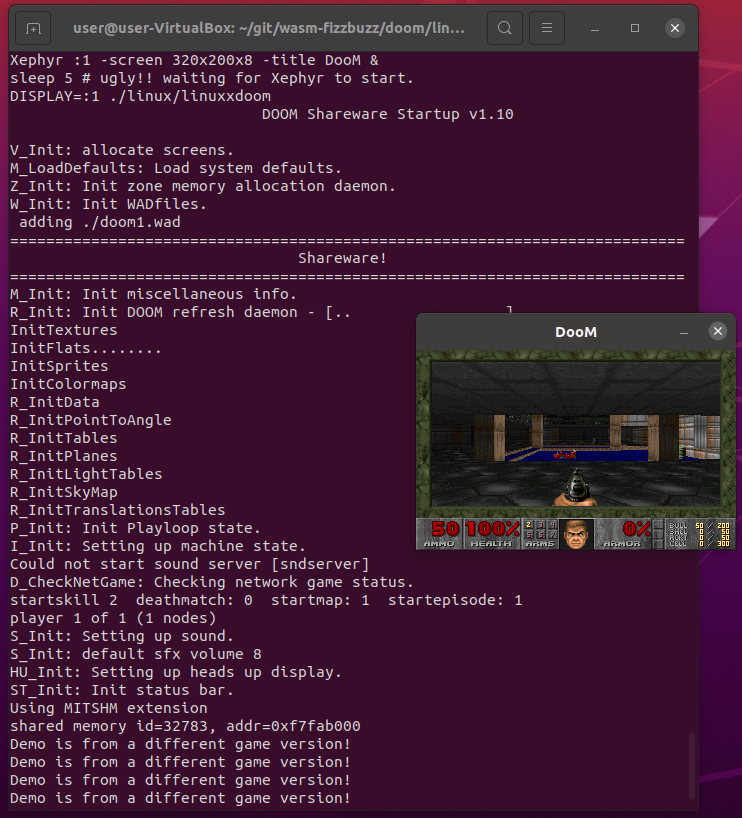

# But can it run Doom?

Can we get the original DOOM game from the 1997 sources to run on WebAssembly?
I guess many have achieved this already.
And with [Emscripten](https://emscripten.org/), there is a generic approach for compiling C applications for the web.
But we want to build everything from scratch in this series, without Emscripten.

---

We start with the original vanilla DOOM sources from https://github.com/id-Software/DOOM at 6ed1e4067082bfe61a7b767b91dc981aa1517f94.

Some minor tweaks are necessary to compile the 1997 sources on my 64bit Ubuntu 20.04.

* b25788df103cd2173dabe2f6b85ca7c43ed79e27
* 03ac200ece379f88e40c70f5c506f4376e6417f7
* 23d4128da47de6c1bbc318a76a1f30bbb3b8a887
* 9f52e0d32e55072f3ece809b6b56d5838fd08eb5
* c5b980f666a47956eef5df430d0f1195c16716c2
* 1c14c3b214f93243dd0b33bef7eea0791f78b3c9
* e2a66727c0e4f4bc0248d966097bd24f7d655ddf

In particular, we want to compile with `-m32`, since the Doom source code has many assumptions about the size of an integer and the size of a pointer being 32bits.
Since we want to ultimately port the game to wasm32, where pointers are 32bit as well, there is no need to make the original DOOM sources 64bit-ready.

With those tweaks, DOOM is starting with X11 rendering:

Time to port this to WebAssembly next.
