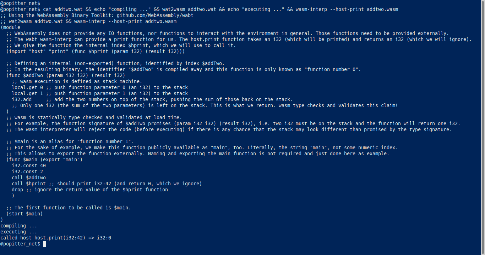
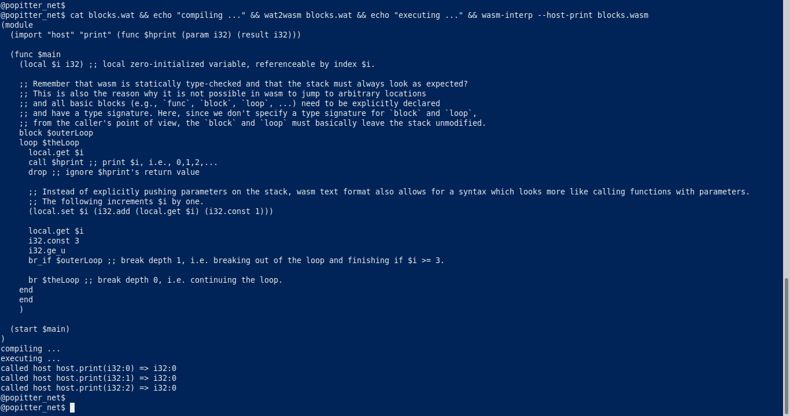

# WebAssembly Crash Course

Basically, WebAssembly (wasm for short) is just a language specification.
Despite the name *Web*Assembly, WebAssembly can also be used outside the browser.

Since browsers are huge and complicated, I don't want to start running wasm in a browser.
Instead, I found the [WebAssembly Binary Toolkit (wabt)](https://github.com/WebAssembly/wabt), which is also [directly included in your Debian distro](https://packages.debian.org/buster/wabt).

Here is a quick getting-started-by example:

src: [addtwo.wat](addtwo.wat)

---

The WebAssembly language does not allow jumps to random locations! :heart_eyes:
Basically, the call graph is known at load time.
This is a really nice theoretical feature, which wasm interpreters can use to validate untrusted wasm code or quickly compile it to native code.

For us as wasm programmers, this means, we have to declare our [basic block](https://en.wikipedia.org/wiki/Basic_block)s as `block`, `loop`-blocks, or `if`-blocks explicitly.

src: [blocks.wat](blocks.wat)

:hand: Handwavingly speaking, a `block` is used to jump forward, comparable to a `break` statement in other imperative languages.
In contrast, a `loop` block is used to jump backward (to the beginning of the loop), comparable to a `continue` statement in other imperative languages.

In this example, I used both a `block` and a `loop` to show how to break out of a loop early as well as continuing the loop.
It would be possible to rewrite this example without the need for a `block`, using only a `loop` and `br_if` (conditional branch) instruction which continues the loop only if `$i < 3`.

