# Compiling to WebAssembly with Rust

For convenience, let's switch from writing WebAssembly in assembly to a more high-level language.
But which one? Many compilers support WebAssembly backends nowadays.

WebAssembly requires explicit memory management. Languages with a runtime or garbage collection (e.g., Golang) require statically compiling their runtime into the wasm binary. While certainly possible (and probably a good idea when targeting [WASI](https://wasi.dev/)), this makes the binary too huge for the web.

---

Looks like Rust is the language of choice. There are three wasm targets offered by rust.

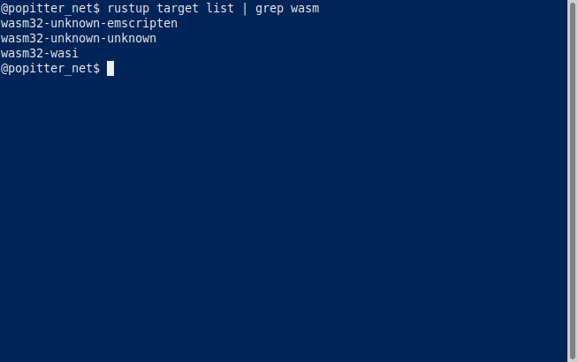

We invented our own API/ABI to talk the the host environment (our API: there is only `putchar` to communicate with the outside world!). I want to stick to this API.

---

I wrote a minimal fizzbuzz in rust. Not nice, but it follows the same structure as the hand-written WebAssembly (which is only 326 bytes) for comparison.

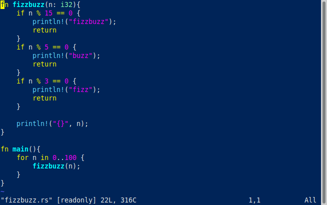

The rust-compiled wasms are huge!

Also emscripten is out; this thread explores wasm from scratch, I don't want another linker.

---

wasi seems to follow the <http://wasi.dev> spec and requires certain functions from the host environment. It doesn't run in `wasm-interp`, since those functions are not provided.
Since I want to develop my own API, wasi is out. Though, it does look cool.

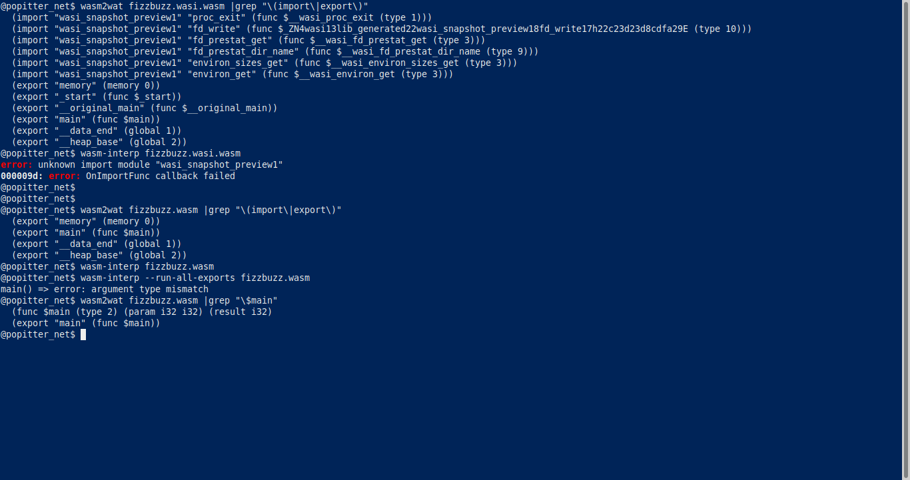

OTOH, the pure wasm does not require any functions from the host environment and just runs in `wasm-interp` (see prev screenshot, well, "run" is a bit of an euphemism, since the rust-generated main function is not executed by `wasm-interp`, but at least, it can be loaded).
Downside: Since it's not importing anything, it cannot interact with the host, i.e. it cannot print anything, nor signal success or failure.

For this "from scratch thread", looks like wasm32-unknown-unknown is the target of choice. :smiley:

---

Without std lib (and `intToASCII` still missing), the generated rust wasm is down to 540K (compared to 1.6M with std lib). This is still 1694 times larger than the hand-written wasm.

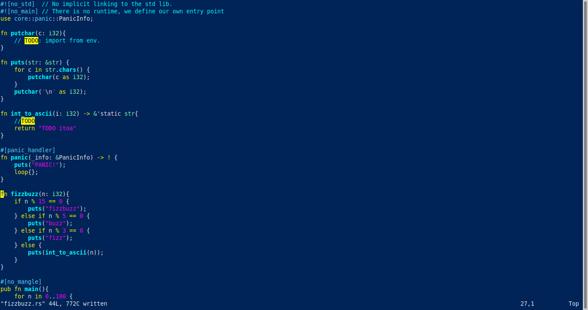

---

Time to make this a cargo-managed project. Also, compiling with `--release` brings us down to 1.4K.
(by the way, I still haven't run the rust-generated wasm yet)

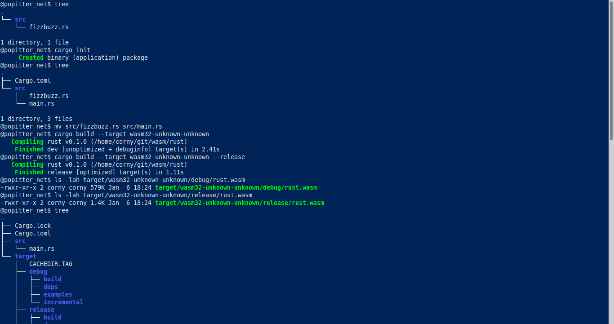

---

Loading the wasm in a browser and importing the `putchar()` function, ... it works!! :joy: :joy: :joy:

Well, it prints a lot of TODOs, but it works.

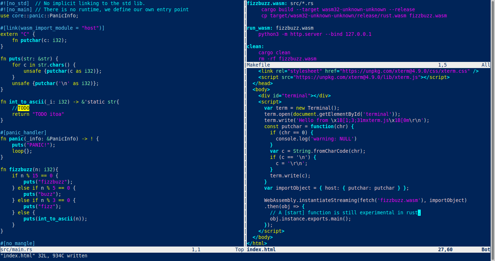
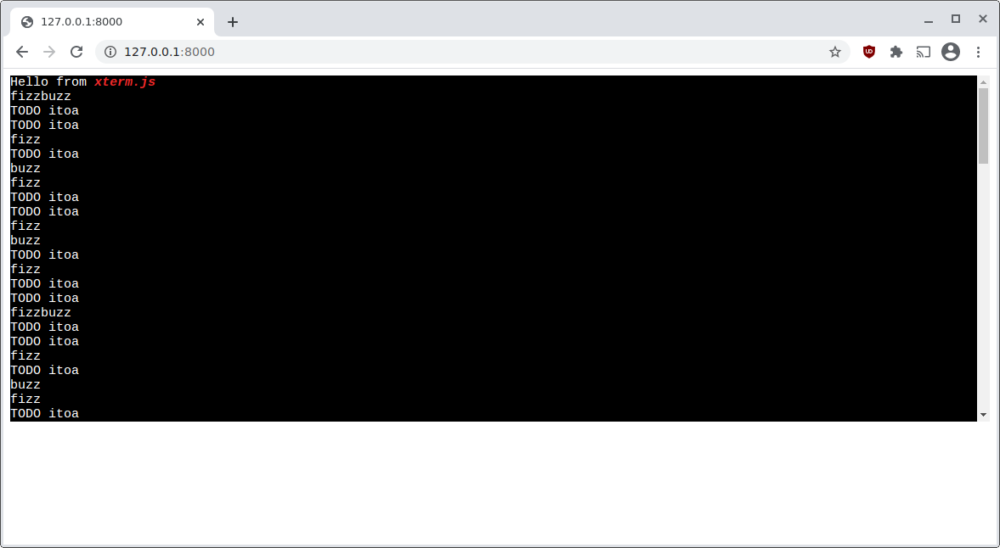

---

Thanks to <https://rustwasm.github.io/book/reference/code-size.html>, the wasm binary size is down to 567 bytes. (rust code unchanged)

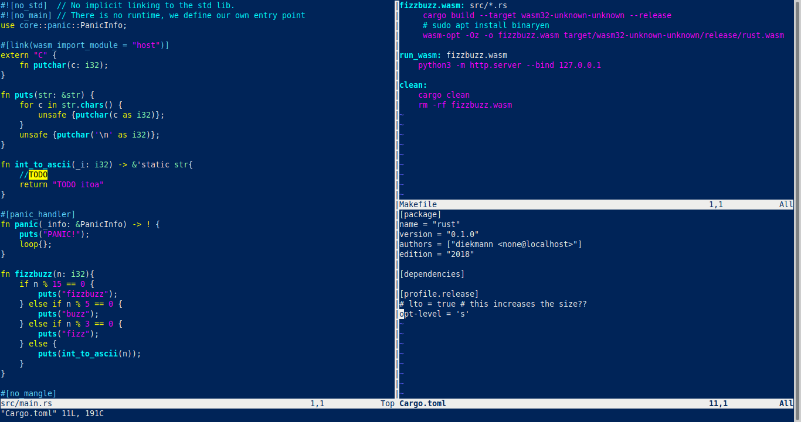

---

To mimic the (non-existing) string handling we had in the hand-written wasm, I'm switching from `&str` to explicit `[u8]` bytes buffer in rust as well.
This also brings us down to a binary size of only 406 bytes.

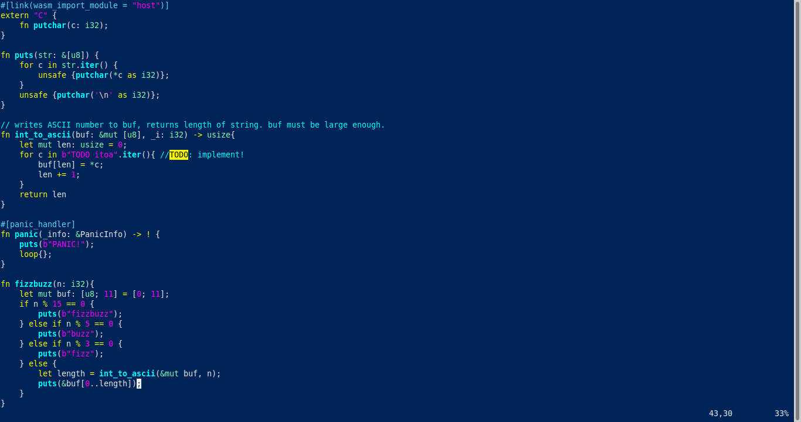

---

Same (bad) `int_to_ascii` implementation as the hand-written wasm. Advantage of rust: unit testing :heart:

Binary size now at 422 bytes. This is only 96 bytes more than the hand-written wasm.

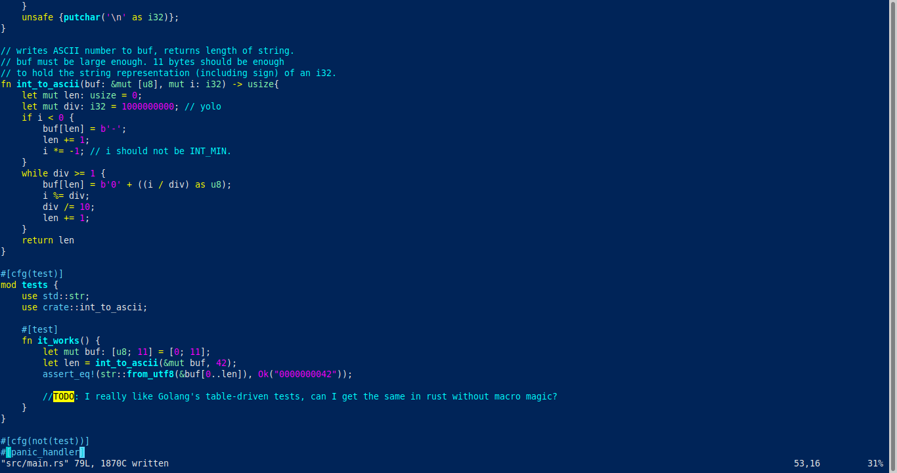

---

Our hand-written wasm didn't export anything. The rust-generated wasm exports the memory and some globals. Let's get rid of those exports. I'd like to keep my memory private. Binary size is down to 370 bytes.

---

Inspecting the generated wasm, ...

`data (i32.const 1048576) "fizzbuzzfizzbuzz")`

Hmm, our hand-written wasm only had the string `"fizzbuzz"` in memory once and to print e.g., fizz, we pointed into the singleton "fizzbuzz" string. Let's do the same trick here. Binary size down to 364

---

xterm.js is now almost 1000 times larger than our wasm. Time to stop the micro-optimization here.

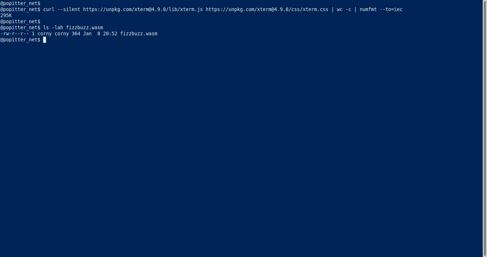

---

Table-driven testing—as known from Golang—is awesome. <https://github.com/golang/go/wiki/TableDrivenTests> The best equivalent I found in rust is to emulate table-driven tests with a macro.

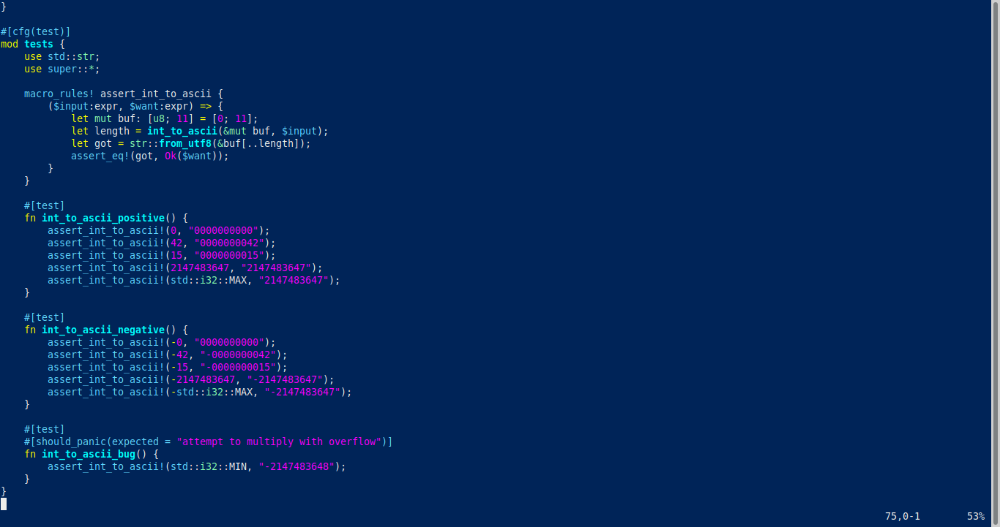

---

With unit tests in place, I feel confident enhancing my number printing function. I follow Golang's style of <https://github.com/golang/go/wiki/CodeReviewComments#indent-error-flow>: The happy path is on the left, all special cases are indented. Required some minor refactoring, so I can `continue` the loop in the special case.

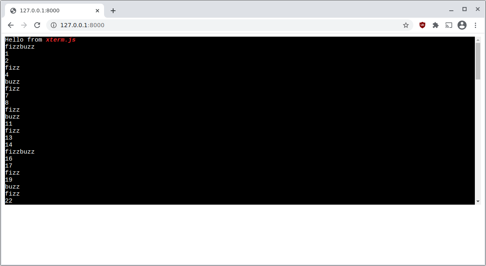

---

Let's test the fizzbuzz function. This function has the side effect of printing the fizzbuzz number and we want to test this side effect. Compiler: Let's use a fake `putchar` function, but only for testing. Works really nice in rust, without the need to change the fizzbuzz function

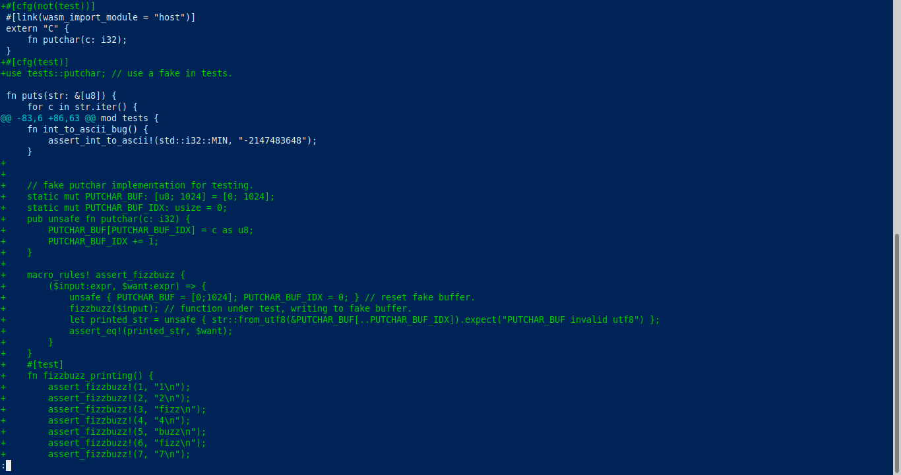

---

Interestingly, the generated wasm is now 2342 bytes. Last time I checked it was only 364 bytes and we only added tests since then. Adding tests should not increase binary size?

Narrator: it's not the tests, it's the improved `int_to_ascii` function. We now ship a panic handler.

---

Remember earlier when I wanted to be clever and micro-optimized by turning off link-time-optimization?
Well, with `lto` on again, we are back at small 415 bytes!

In the long run, it's never worth to pretend to be clever and fight the toolchain.

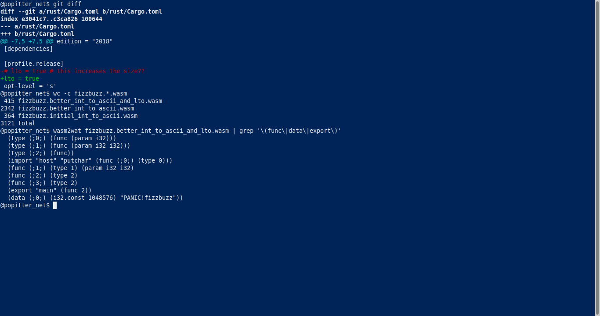

Well, reverting to the old `int_to_ascii` function and keeping `lto` on, the binary size would even go down to 319 bytes.

All config options somebody set at some point in time for some reason are outdated! Question everything!

---

Demo at <https://diekmann.github.io/wasm-fizzbuzz/rust>.

---

Looks like we developed a small and working FizzBuzz implementation from scratch.
Thanks for following along :blush:
